# Studium

Turn sources into cited chapters, interactive explanations and Anki cards on your own server.

[](LICENSE)
[](.github/workflows/ci.yml)
[](docs/SELF_HOSTING.md#upgrading-and-migrations)
[](compose.yaml)

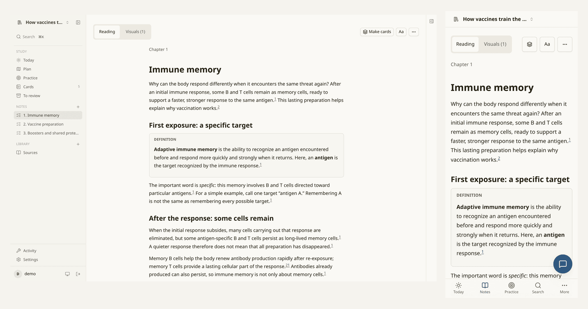

## What it does

- Builds a chapter plan around your goal, level and sources; you can edit it before drafting.
- Writes cited Markdown chapters, then checks their evidence with a second model.
- Explains ideas with interactive visuals, credited images, equations and video moments.
- Answers questions beside the chapter, with source citations where the answer uses evidence.
- Generates practice quizzes and small Anki cards; cards pass a critic and your approval before export.
- Keeps notes, plans and cards as plain files with git history, and compiles a PDF book locally.
- Works in a phone browser or installed PWA, with separate accounts and study trees.

## Feature tour

| Plan and read | Explore and practise |
| --- | --- |
| 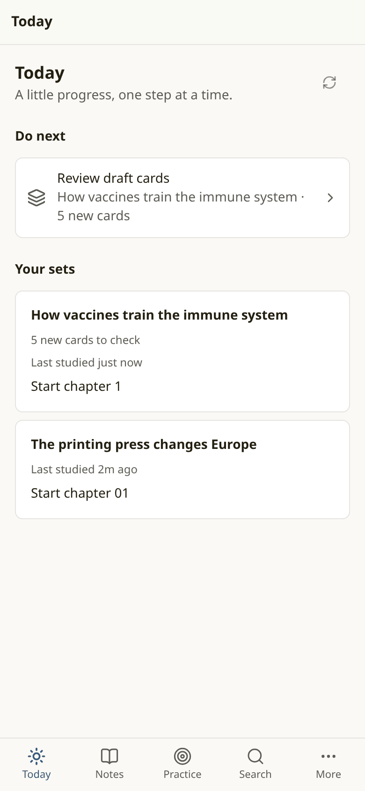<br>Today brings your sets and next steps together. | 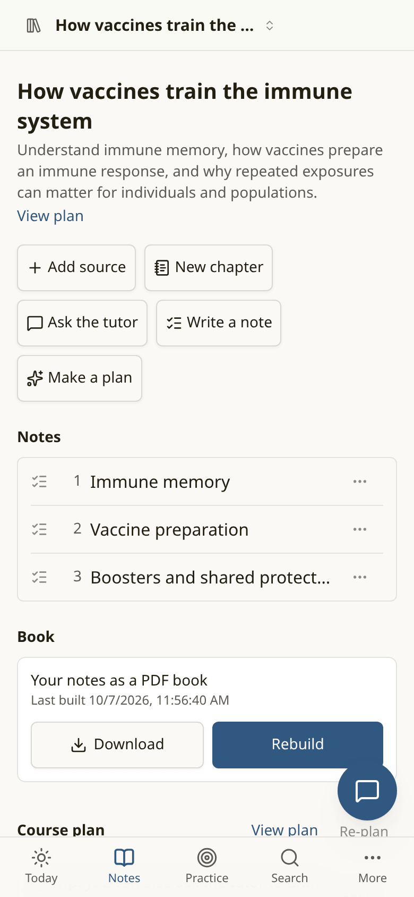<br>Open a chapter or build the set's book. |
| 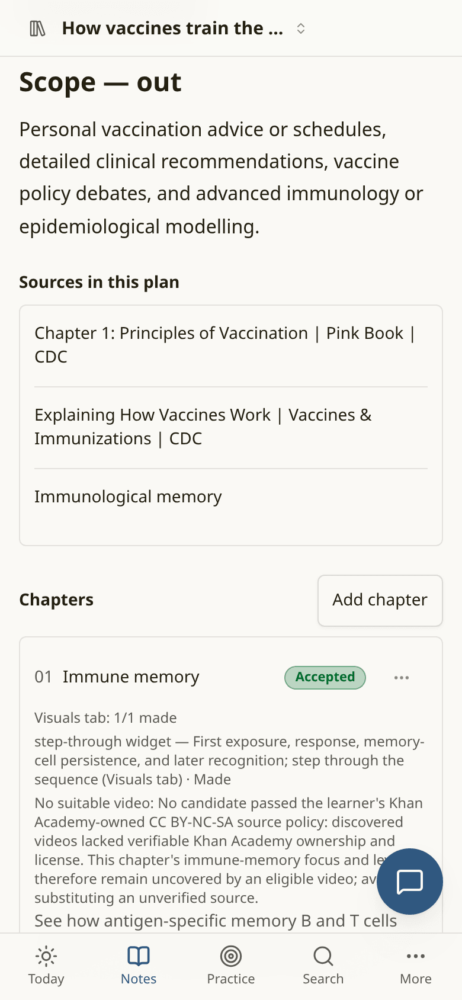<br>Review what each chapter will teach and show. | 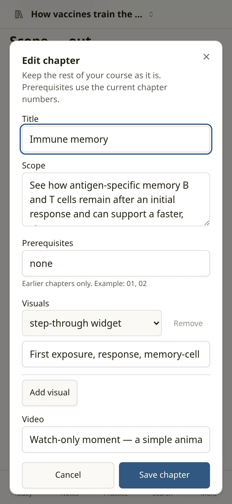<br>Change a chapter without replacing the whole plan. |
| 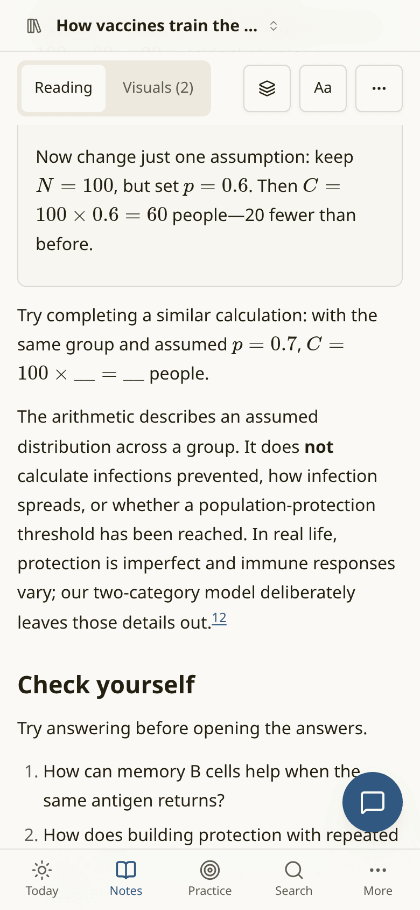<br>Read equations alongside the explanation. | 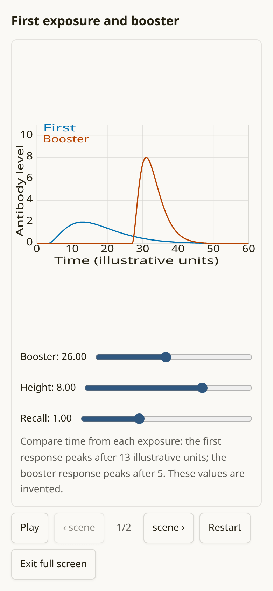<br>Step through a process in the Visuals tab. |
| 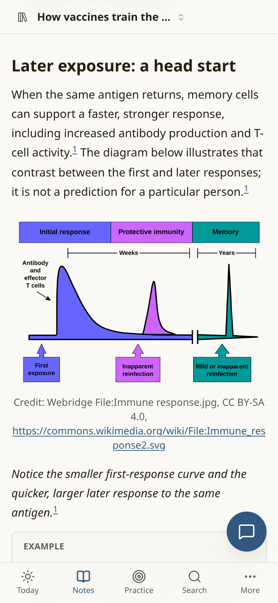<br>Follow an image's credit back to its source. | 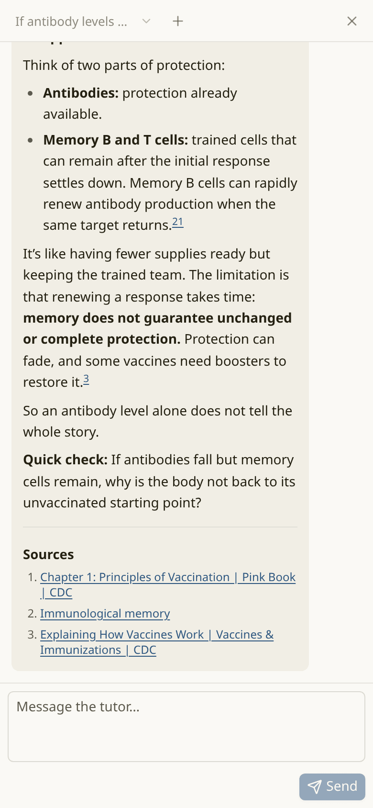<br>Ask a question while the chapter is in view. |
| 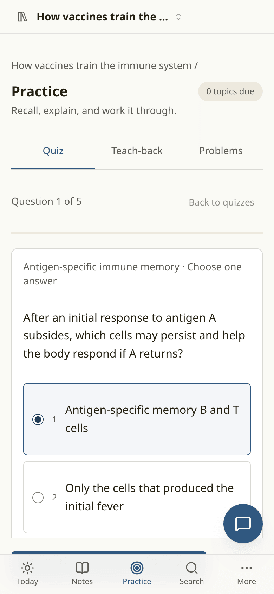<br>Try a question before seeing feedback. | 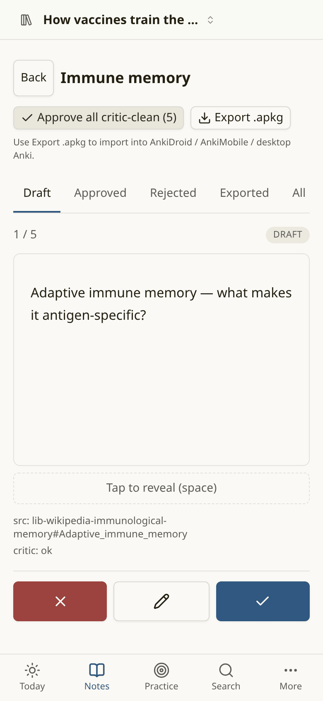<br>Review cards before sending them to Anki. |
| 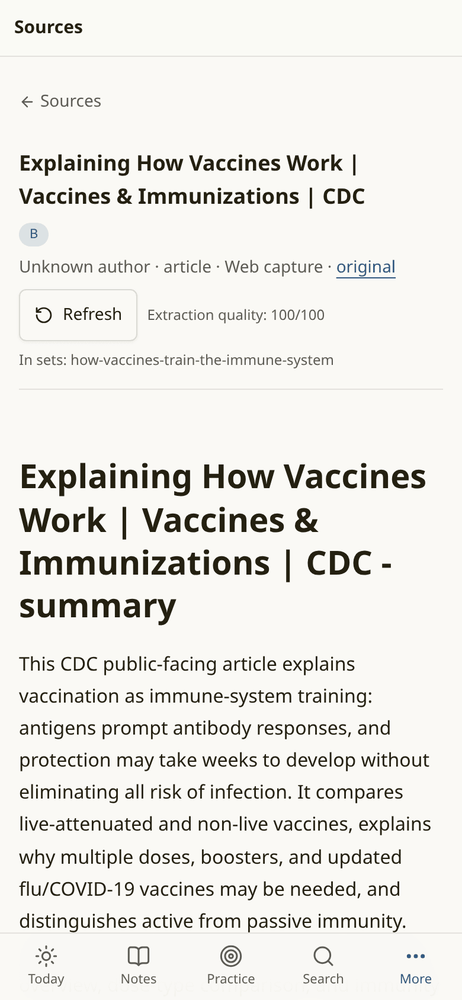<br>Inspect the material behind a chapter. | <br>Take the chapters with you as a PDF. |
| 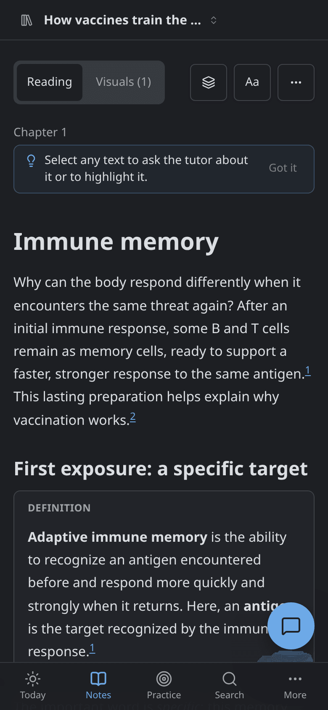<br>Choose light, dark or sepia reading. | 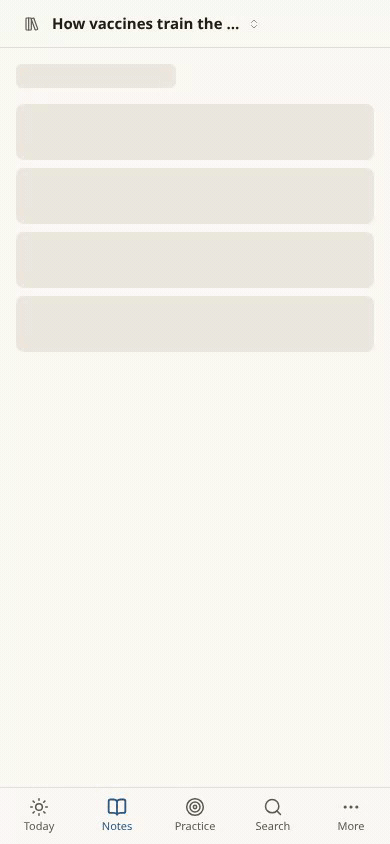<br>A short walk from chapter to visual. |

Screenshots use a fresh demo with public CDC material and Wikipedia sources.
Source and image attribution is recorded in the [screenshot notes](docs/screenshots/README.md).
Use of CDC material does not imply endorsement by CDC or the US government.

## Quick start (Docker)

```sh
mkdir studium && cd studium
curl -fsSLO https://raw.githubusercontent.com/krishna-vinci/studium/main/compose.yaml
curl -fsSL https://raw.githubusercontent.com/krishna-vinci/studium/main/.env.example -o .env
docker compose up -d
```

Open `http://localhost:3000`. First-run setup creates the admin account; read the
setup code from `docker compose logs studium` if prompted. Then connect a model
provider and select your models in Settings.

The release uses `ghcr.io/krishna-vinci/studium:latest`, service `studium`, a
loopback-only port, and persistent `./data:/data` and `./pi-agent:/pi-agent`
volumes. See the [full installation guide](docs/SELF_HOSTING.md#docker-compose-install).

## Requirements

Start with about 2 CPU cores and 2 GB RAM for Studium with remote models; this is
a planning estimate. Concurrent jobs, PDF builds and large libraries need more
headroom. MinerU needs several additional GB if you run it on the same machine.
You need a model provider: an API key or a supported subscription connected
through Pi. Phone PWA installation needs HTTPS with a trusted certificate.

## Configuration

| Configure | Where to start |
| --- | --- |
| API keys or Pi subscriptions | [Model providers](docs/SELF_HOSTING.md#adding-model-providers) |
| Default and per-role models | [Role routing](docs/SELF_HOSTING.md#which-roles-use-which-model) |
| Data paths, concurrency and service URLs | [Environment summary](docs/SELF_HOSTING.md#configuration-summary) |
| Public URL and trusted proxy | [HTTPS](docs/SELF_HOSTING.md#https-and-reverse-proxy) |
| Accounts and AI access | [Multi-user accounts](docs/SELF_HOSTING.md#multi-user-accounts) |

## Optional integrations

- [Exa](docs/SELF_HOSTING.md#exa): web/video search with a per-workspace budget guard.
- [SearXNG](docs/SELF_HOSTING.md#searxng): self-hosted fallback search.
- [MinerU](docs/SELF_HOSTING.md#mineru): richer PDF equations, tables and figures.
- [Firecrawl](docs/SELF_HOSTING.md#firecrawl): extraction for difficult web pages.
- [YouTube cookies](docs/SELF_HOSTING.md#youtube-cookies): help retrieve transcripts on blocked networks.
- [ntfy](docs/SELF_HOSTING.md#ntfy): background job notifications.
- [restic / rclone](docs/SELF_HOSTING.md#backups-with-restic-or-rclone): scheduled backups to your own destination.

## Updating, backup and restore

Back up before upgrading, then run `docker compose pull studium` and
`docker compose up -d studium`. Preserve the whole data directory, its `.secret`,
Pi credentials and your instance environment. Git history is useful for undo;
it does not include original source files or chats. Follow the
[backup and restore instructions](docs/SELF_HOSTING.md#manual-whole-instance-backup-and-restore)
and save the backup recovery kit outside the server.

## How it works

A React PWA talks to one Hono server. The server runs background jobs and streams
updates; Pi supplies the models and scoped agent tools. SQLite stores accounts
and encrypted integration secrets. Learning content lives in each user's
[study tree](docs/STUDY_TREE.md): plain Markdown, source metadata, media and git
history. You can open your notes in another editor. The [design docs](docs/)
explain the roles, review loop and data contract.

## Privacy and security

You control the server and its files. The models you select receive the source
passages and conversation context needed for their work; search and extraction
services receive their requests. YouTube players load after a tap. Self-hosting
does not make cloud model requests local.

Accounts have separate workspaces. Agents have role-specific tools, confined
file access and no shell; interactive sketches run in scripts-only sandboxed
iframes. Plans, chapters and cards have review flows. Keep provider credentials
outside study trees, protect backups, and put remote access behind HTTPS. Read
[the security and deployment reference](docs/DEPLOY.md).

## Development, licence and acknowledgements

See [CONTRIBUTING.md](CONTRIBUTING.md) for development and scoped checks.
Studium is licensed under [AGPL-3.0-only](LICENSE). Third-party code and demo
content retain their own notices and licences.

Studium builds on Memos' interface patterns, the Pi SDK, React, Hono, KaTeX,
CodeMirror, shadcn, Pandoc, Typst, MinerU and other open-source projects.
See [third-party notices](NOTICE) and the [teaching principles](docs/TEACHING.md).
