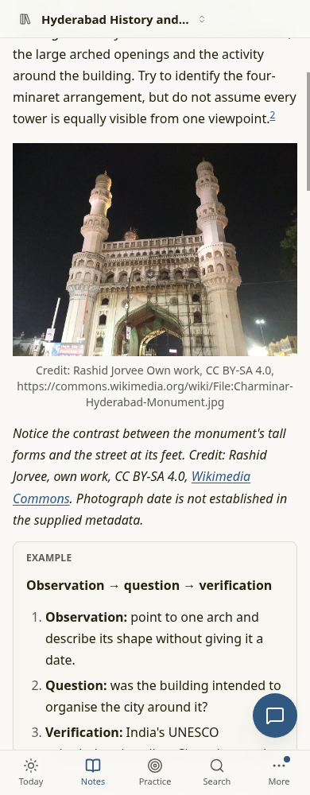
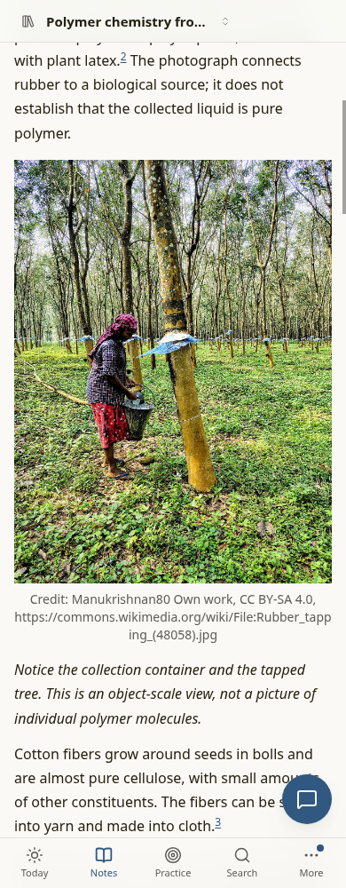

# M15 — Real images in chapters: implementation report

Implemented Work 1–6 on `codex/m15`. Licensed real-image search, planning, compact briefs, asset credits, raster checking and book credits are connected. No dependencies were added. SVG schematic authoring is unchanged.

The real Hyderabad chapter passed its independent checker. The polymers chapter embeds two licensed photos and has zero image-specific blockers, but remains **draft** because registered source coverage and video timing do not fulfil its other teaching requirements. This is not a claim that both complete chapters passed review.

## Implementation

- Detection reads real LibreTexts page tags (including HTML-encoded JSON), rights meta, rel=license and schema.org license; Commons file metadata supplies licence, artist and institutional credit. OpenStax defaults to CC BY 4.0, with individual figure exceptions preserved. Wikipedia prose never grants permission to its images.
- Image backends normalize Commons, anonymous/token Openverse, public-domain Met, NASA-owned media and key-gated Smithsonian media-level CC0. All network retrieval uses `safeFetch`; requests and responses are bounded and failures do not expose credentials. Third-party NASA work does not inherit NASA permission. Exa imageLinks need fetched-page permissions before inclusion.
- Stage 1 records up to three `Image:` needs. Stage 2 derives a concise catalogue query and lets the Outliner choose from ranked permissible captured/search candidates, or explain an unsuitable slot. Candidate metadata is wrapped as untrusted evidence; selection tools accept only provided URLs.
- A brief stays at most 5,120 UTF-8 bytes. Long thumbnail URLs and archival credits initially exceeded that budget in the real polymers run. Compact prompt hints now omit secondary fields and abbreviate titles/creators when necessary; complete attribution stays in `.evidence.json` and is resolved by `save_asset` before creating the asset sidecar and exact Markdown credit. No image slot or licence is discarded to meet the budget.
- `media.allowNonCommercial` defaults true; disabling it rejects NC reuse at selection and checking. ND uses original URLs/bytes, rejects Commons derivative thumbnails and verifies the saved hash on review. Existing MIME, 5 MB, 6,000 px, 50 MB quota, path confinement and lock rules remain active.
- Every embedded raster needs a confined asset, acceptable sidecar and visible creator/licence/source credit. Unknown/restricted captured images cannot be relabelled through an asset sidecar. Planned missing images require an explicit marker and muted learner explanation. Reader credit rendering already existed and is verified using the real Markdown renderer; book conversion now retains the credit as printable text.
- A real Commons cotton record exposed duplicated hidden “Unknown author” HTML. Credit extraction now ignores hidden elements; a recorded fixture protects this behavior. The temp trial's cotton credit was cleaned using that fixture without changing pixels or chapter status. The original checker report is retained and predates this metadata-only cleanup.

## Licence re-detection on a temporary live-library copy

Live `data/` was read only. Re-detection used `/tmp/studium-m15-trial-AaubLU/tree`; no live figures or metadata were modified.

| Catalogue scope | Total | Unknown before | Unknown after | Unknown → known |
| --- | ---: | ---: | ---: | ---: |
| Locally captured source figures | 98 | 71 | 30 | **41** |
| All image catalogue entries, including remote-only entries | 286 | 224 | 171 | **53** |

The 98 captured figures now have 68 identified licences, compared with 27 before. Five source-page fetch failures retained their original metadata; no permission was inferred from a failed fetch. These are licence-identification counts, not a claim that every identified licence is reusable. See [summary](m15-images-evidence/redetection-summary.json) and [per-source results](m15-images-evidence/redetection.json).

## Real plan → brief → draft evidence

The trial copied the live tree, refreshed default skills in the copy and planned each set. Only the first proposed chapter per set was locally approved/refined/drafted. Initial runs exposed the long-query and brief-budget failures described above; corrected drafting reused those approved plans. Existing subscription runtime supplied a three-identical-failures loop guard, without a fixed subscription call cap. Normal app jobs wrote their history in the **temporary tree**; no worktree commit, push or branch change was performed.

| Chapter | Final brief | Raster slots | Review outcome |
| --- | ---: | --- | --- |
| [Meet Hyderabad Through Charminar](m15-images-evidence/hyderabad-history/notes/01-meet-hyderabad-through-charminar.md) | 4,432 bytes | Charminar selected and embedded | Checked |
| [Familiar objects, atoms and polymer chains](m15-images-evidence/polymers/notes/01-familiar-objects-atoms-and-polymer.md) | 4,807 bytes after credit cleanup (4,821 during drafting) | Rubber and cotton embedded; combined PE/PET photo explicitly unavailable | Draft; two non-image blockers |

### Selected images and placement

| Image / saved preview | Creator / credit | Licence | Original landing page | Teaching placement |
| --- | --- | --- | --- | --- |
| [Charminar](m15-images-evidence/hyderabad-history/assets/charminar-street.jpg), 1,280×960 | Rashid Jorvee; Own work | CC BY-SA 4.0 | [Commons file](https://commons.wikimedia.org/wiki/File:Charminar-Hyderabad-Monument.jpg) | Image marker/embedding at note lines 19–20, immediately after observing arches/minarets and street activity; caption asks what the photograph can establish before historical interpretation. |
| [Rubber tapping](m15-images-evidence/polymers/assets/rubber-tapping-2.jpg), 1,280×1,707 | Manukrishnan80; Own work | CC BY-SA 4.0 | [Commons file](https://commons.wikimedia.org/wiki/File:Rubber_tapping_(48058).jpg) | Lines 26–27 beside latex/natural-rubber teaching; caption identifies container/tree and distinguishes object scale from individual molecules. |
| [Cotton bolls](m15-images-evidence/polymers/assets/cotton-bolls-2.jpg), 1,280×881 | Author unknown or not provided; U.S. National Archives and Records Administration | Public domain | [Commons archival file](https://commons.wikimedia.org/wiki/File:Industries_of_War_-_Cloth_-_Cotton_Pickers_-_MANUFACTURING_COTTON_CLOTH_AT_AMOSKEAG_Manufacturing_CO._PLANT,_MANCHESTER,_New_Hampshire._Cotton_bolls_in_various_stages_of_growth_-_NARA_-_31486788.jpg) | Lines 32–33 after cotton/cellulose teaching; caption distinguishes closed bolls/exposed fibers from later spinning/weaving. |

Each saved preview is the actual embedded raster, downloaded without local pixel edits. Complete download/thumbnail URL, creator, source, licence URL, dimensions and SHA-256 are in its adjacent `.json` sidecar and the chapter's `.evidence.json`. These three are non-ND images; Commons supplies resized source versions. ND originals and tampering are exercised with fake test bytes, not claimed as a live ND trial.

The PE/PET slot was not filled with an unverified generic plastic photograph: candidate metadata did not reliably identify both required materials. Note lines 21–23 record the concrete omission and learner-facing explanation. A source-grounded SVG schematic remains at lines 78–79. Existing interactive declarations remain part of the trial chapters.

### 390 px reader checks

The built web app was served locally with a read-only API for the temporary tree and a synthetic session identity. Headless Chrome loaded each chapter at 390×1,000, scrolled to its real image, confirmed successful decoding and visible Credit text, and checked horizontal overflow. **Two chapters passed; zero runtime exceptions; no horizontal overflow.** These are reader checks, not authentication or deployment tests.

[Hyderabad screenshot](m15-images-evidence/390-hyderabad-history-image.png) · [Polymers screenshot](m15-images-evidence/390-polymers-image.png) · [browser measurements](m15-images-evidence/browser-results.json)

Final deterministic checks on both temporary notes report no `figureReuseWarnings` and no `plannedImageBlockers`. Book media conversion of the three actual credited raster lines preserves all three printable credits: [results and metadata cleanup](m15-images-evidence/image-checks.json). The independent full chapter checker report was not rewritten or bypassed.

## Usage and spend

Cumulative usage includes both initial and corrected trials: **152 requests and 152 recorded results**. Role models were Outliner/Drafter `openai-codex/gpt-6.1-sol` and Checker/Librarian `github-copilot/gpt-6-luna`; classifier was disabled in the temporary configuration. Keys were loaded only by Node `--env-file`; no key values are reported or saved here.

| Provider | Calls | Fresh input tokens | Output tokens | Cache-read tokens | Cache-write tokens | Incremental model API charge |
| --- | ---: | ---: | ---: | ---: | ---: | ---: |
| openai-codex | 110 | 794,686 | 38,248 | 3,285,376 | 0 | $0 (subscription) |
| github-copilot | 42 | 126 | 28,734 | 3,957,573 | 643,627 | $0 (subscription) |

Exa: **11 reported requests / $0.080 total**, aggregating six unique job records across both runs (initial 9/$0.066, corrected 2/$0.014). The temporary copy preserved the live Exa budget before adding trial requests; the live budget was not reset or written. Job `costUsd` estimates are retained as accounting evidence, not treated as subscription cash charges. No paid setup smoke tests were run. [Usage ledger](m15-images-evidence/usage.json) · [unique jobs, provider call counts and Exa totals](m15-images-evidence/trial-summary.json).

## Tests run

All automated tests use fakes; only the explicitly separate fixture recording and temp-tree trial contacted live services. No full repository suite was run.

| Exact command | Final result |
| --- | --- |
| `pnpm install --frozen-lockfile --prefer-offline` | Passed, lockfile unchanged |
| `pnpm --filter @studium/server exec vitest run src/ingest/ src/search/ src/tree/ src/jobs/ src/agent/builtins/save-asset.test.ts src/agent/tools.test.ts src/agent/figure-reuse.test.ts` | **517 passed, 61 files; 0 failed** |
| `pnpm --filter @studium/server exec vitest run src/ingest/image-license.test.ts src/search/images.test.ts` | 8 passed, 2 files; 0 failed after hidden-author fix |
| `pnpm --filter @studium/shared exec vitest run src/frontmatter.test.ts` | 8 passed, 1 file; 0 failed |
| `pnpm --filter @studium/web exec vitest run src/components/Reader/NoteImage.test.tsx` | 1 passed, 1 file; 0 failed |
| `pnpm --filter @studium/server exec tsc --noEmit` | Passed |
| `pnpm --filter @studium/web exec tsc --noEmit` | Passed |
| `pnpm --filter @studium/shared exec tsc --noEmit` | Passed |
| `pnpm --filter @studium/web build` | Passed; existing large-chunk warning |
| `rtk proxy pnpm exec biome check <changed TS/TSX/MJS/JSON files listed below>` | Passed; exact expanded command in [validation manifest](m15-images-evidence/validation.json) |
| `pnpm --filter @studium/server exec node scripts/m15-image-fixtures.ts` | Recorded Commons/Openverse/Met/NASA primary API shapes and LibreTexts page tags; cotton metadata recorded separately with the same safeFetch limits and added to this script |
| `pnpm --filter @studium/server exec node --env-file=/home/krishna/learny/.env --import tsx scripts/m15-images-trial.ts /home/krishna/learny/data/users/krishna` | Initial plan/draft trial completed with failures informing the fixes |
| `pnpm --filter @studium/server exec node --env-file=/home/krishna/learny/.env --import tsx scripts/m15-images-trial.ts /home/krishna/learny/data/users/krishna /tmp/studium-m15-trial-AaubLU` | Corrected drafts completed; Hyderabad checked, polymers draft |
| `pnpm --filter @studium/server exec node scripts/m15-images-browser.mjs /tmp/studium-m15-trial-AaubLU/tree` | Both 390 px reader checks passed |

Initial local test assertions/mocks were adjusted to the new behavior. The first real run's full catalogue-query and brief-budget failures were fixed before the corrected run. No unrelated test failure was repaired and no unrelated suite was expanded.

## Not done / open questions

- **Polymers source coverage:** `polymers/log/checks/01-familiar-objects-atoms-and-polymer.md:9` ([original checker](m15-images-evidence/polymers/log/checks/01-familiar-objects-atoms-and-polymer.md#1-blocker--compound-and-mixture-objective-is-deferred-rather-than-taught)), and [note line 88](m15-images-evidence/polymers/notes/01-familiar-objects-atoms-and-polymer.md): the approved plan requests compounds-versus-mixtures classification, but registered introductory sources do not define the distinction. Adding a source or changing approved curriculum scope is outside M15 image implementation; this item was stopped and reported.
- **Polymers video:** `polymers/log/checks/01-familiar-objects-atoms-and-polymer.md:17` and `polymers/notes/01-familiar-objects-atoms-and-polymer.md:56`: the registered Khan Academy transcript has `t0` with no verified end marker. No end time was invented. The watch-only fallback fails the selected bounded-moment contract; repairing source timing is outside this image change. The note remains draft.
- **PE/PET photograph:** omitted with the required explanation because the trial could not reliably identify both materials in the available candidates. This is an allowed image omission, not a silently fulfilled slot.
- **Smithsonian live verification:** no configured key was available; normalization/gating uses a fake API shape. No key request or paid setup probe was attempted. Openverse was exercised anonymously; optional-token authentication was not exercised live.
- **Cotton credit:** the original checker records the hidden-author duplication. Parser and fixture regression are fixed; only the temporary evidence metadata/note credit were normalized afterward. The image hash and draft status were preserved; the checker was not asked to re-approve unrelated blockers.
- No production deployment, live-library write, migration, new screen, commit or push. Concurrent delete routes/helpers and Reader/SetHome actions were not edited. `AGENT_MEMORY.md`, `.env*` and `.claude/` were not edited. Trial/browser processes started for this task were closed.

## Changed files

- `docs/DEPLOY.md` — Documents NC policy and optional environment-only image API credentials.
- `docs/STUDY_TREE.md` — Documents image slots, compact briefs, full evidence and credited raster sidecars.
- `docs/decisions/LOG.md` — Locks D37 licensed real-image policy.
- `docs/plans/2026-10-06-m15-images-report.md` — Records implementation, trial evidence, usage, validation and outstanding teaching blockers.
- `docs/plans/m15-images-evidence/390-hyderabad-history-image.png` — Captures the real reader at 390 px with visible image credit.
- `docs/plans/m15-images-evidence/390-polymers-image.png` — Captures the real reader at 390 px with visible image credit.
- `docs/plans/m15-images-evidence/browser-results.json` — Records successful image loading, visible credit and screenshot measurements.
- `docs/plans/m15-images-evidence/hyderabad-history/PLAN.md` — Preserves the locally approved trial plan and image/visual/video requirements.
- `docs/plans/m15-images-evidence/hyderabad-history/assets/charminar-street.jpg` — Preserves the actual embedded trial image; licence/creator in adjacent sidecar.
- `docs/plans/m15-images-evidence/hyderabad-history/assets/charminar-street.json` — Preserves the actual embedded trial image credit/hash sidecar.
- `docs/plans/m15-images-evidence/hyderabad-history/curriculum.md` — Preserves the locally approved trial plan and image/visual/video requirements.
- `docs/plans/m15-images-evidence/hyderabad-history/log/checks/01-meet-hyderabad-through-charminar.md` — Preserves the original independent trial checker report, before cotton-credit cleanup.
- `docs/plans/m15-images-evidence/hyderabad-history/media/01-meet-hyderabad-through-charminar.evidence.json` — Preserves full trial image selection/candidate evidence and attribution.
- `docs/plans/m15-images-evidence/hyderabad-history/media/01-meet-hyderabad-through-charminar.md` — Preserves the bounded final trial prompt brief.
- `docs/plans/m15-images-evidence/hyderabad-history/notes/01-meet-hyderabad-through-charminar.md` — Preserves the final temporary trial chapter, with original checked/draft status.
- `docs/plans/m15-images-evidence/image-checks.json` — Records metadata-only cotton cleanup and zero final image-specific blockers.
- `docs/plans/m15-images-evidence/polymers/PLAN.md` — Preserves the locally approved trial plan and image/visual/video requirements.
- `docs/plans/m15-images-evidence/polymers/assets/cotton-bolls-2.jpg` — Preserves the actual embedded trial image; licence/creator in adjacent sidecar.
- `docs/plans/m15-images-evidence/polymers/assets/cotton-bolls-2.json` — Preserves the actual embedded trial image credit/hash sidecar.
- `docs/plans/m15-images-evidence/polymers/assets/molecule-and-chains.svg` — Preserves the unchanged source-grounded schematic used in the trial note.
- `docs/plans/m15-images-evidence/polymers/assets/rubber-tapping-2.jpg` — Preserves the actual embedded trial image; licence/creator in adjacent sidecar.
- `docs/plans/m15-images-evidence/polymers/assets/rubber-tapping-2.json` — Preserves the actual embedded trial image credit/hash sidecar.
- `docs/plans/m15-images-evidence/polymers/curriculum.md` — Preserves the locally approved trial plan and image/visual/video requirements.
- `docs/plans/m15-images-evidence/polymers/log/checks/01-familiar-objects-atoms-and-polymer.md` — Preserves the original independent trial checker report, before cotton-credit cleanup.
- `docs/plans/m15-images-evidence/polymers/media/01-familiar-objects-atoms-and-polymer.evidence.json` — Preserves full trial image selection/candidate evidence and attribution.
- `docs/plans/m15-images-evidence/polymers/media/01-familiar-objects-atoms-and-polymer.md` — Preserves the bounded final trial prompt brief.
- `docs/plans/m15-images-evidence/polymers/notes/01-familiar-objects-atoms-and-polymer.md` — Preserves the final temporary trial chapter, with original checked/draft status.
- `docs/plans/m15-images-evidence/redetection-summary.json` — Records all/local unknown-to-known licence counts.
- `docs/plans/m15-images-evidence/redetection.json` — Records per-source licence refresh counts and fetch failures.
- `docs/plans/m15-images-evidence/trial-summary.json` — Records unique jobs, provider call counts and total Exa spend.
- `docs/plans/m15-images-evidence/usage.json` — Records cumulative provider token usage.
- `docs/plans/m15-images-evidence/validation.json` — Records final check counts and the exact expanded Biome command.
- `server/scripts/m15-browser-api.ts` — Serves read-only temporary-tree course/assets for reader validation.
- `server/scripts/m15-image-fixtures.ts` — Records bounded public API and licence-tag fixtures without credentials/model calls.
- `server/scripts/m15-images-browser.mjs` — Checks 390 px real-reader images/credits and saves screenshots; closes its own processes.
- `server/scripts/m15-images-trial.ts` — Runs reproducible temporary-copy re-detection and plan/brief/draft trials with usage logging.
- `server/src/agent/builtins/save-asset.test.ts` — Tests NC policy, full credits and ND handling alongside confinement/limit regressions.
- `server/src/agent/builtins/save-asset.ts` — Stores full selected/source credits and ND hashes, returning exact image Markdown.
- `server/src/agent/figure-reuse.test.ts` — Tests visible credits, NC policy, unknown/restricted reuse and ND tampering.
- `server/src/agent/figure-reuse.ts` — Blocks raster licence/credit problems and altered ND files while preserving SVG behavior.
- `server/src/ingest/figures.test.ts` — Updates captured figure assertions for complete attribution.
- `server/src/ingest/figures.ts` — Captures Commons permissions, artist/source metadata, original ND URLs and dimensions.
- `server/src/ingest/fixtures/libretexts-license.html` — Records the exact LibreTexts hidden licence tag HTML excerpt.
- `server/src/ingest/image-license.test.ts` — Tests real LibreTexts tags, page licences and NC configuration.
- `server/src/ingest/image-license.ts` — Adds shared licence detection, NC policy and clean visible credit extraction.
- `server/src/ingest/images.ts` — Extends source-image metadata types.
- `server/src/ingest/library.test.ts` — Checks inferred source-image licence and source page.
- `server/src/ingest/web.ts` — Uses shared page permissions while retaining individual figure exceptions.
- `server/src/jobs/book-job.test.ts` — Verifies book credit text and existing media behavior.
- `server/src/jobs/book-media.ts` — Preserves image title credits as printable paragraphs with Markdown escaping.
- `server/src/jobs/draft-job.ts` — Supplies exact image-credit, marker, caption and omission instructions.
- `server/src/jobs/image-plan.test.ts` — Tests slot selection and original selected attribution with fakes.
- `server/src/jobs/image-plan.ts` — Queries concise catalogue terms and selects useful licensed images through Outliner tools.
- `server/src/jobs/media-plan.ts` — Integrates image refinement and preserves full candidate evidence.
- `server/src/jobs/plan-job.ts` — Prompts image needs and validates the three-slot limit.
- `server/src/jobs/source-preflight.ts` — Refines image slots alongside existing visuals/video before drafting.
- `server/src/search/fixtures/commons-cotton-images.json` — Records public commons-cotton API metadata for deterministic normalization tests.
- `server/src/search/fixtures/commons-images.json` — Records public commons API metadata for deterministic normalization tests.
- `server/src/search/fixtures/met-images.json` — Records public met API metadata for deterministic normalization tests.
- `server/src/search/fixtures/nasa-images.json` — Records public nasa API metadata for deterministic normalization tests.
- `server/src/search/fixtures/openverse-images.json` — Records public openverse API metadata for deterministic normalization tests.
- `server/src/search/images.test.ts` — Tests recorded backend shapes, NC ranking, ND originals, gating and individual exceptions.
- `server/src/search/images.ts` — Adds five safeFetch image backends, ranking and page-permitted Exa image candidates.
- `server/src/tree/curriculum.ts` — Parses optional per-chapter Image intent lines.
- `server/src/tree/media-brief.test.ts` — Tests image markers, omissions and lean/full-attribution separation.
- `server/src/tree/media-brief.ts` — Adds image choices, bounded prompt compaction, full-attribution resolution and slot blockers.
- `shared/src/schemas.ts` — Adds media.allowNonCommercial with default true.
- `skills/.defaults-history.json` — Records updated hashes for the three modified default skills.
- `skills/draft-chapter/SKILL.md` — Directs real-image placement, exact credits, ND preservation and explained omissions.
- `skills/media-authoring/SKILL.md` — Explains when a photograph teaches better and how to save/credit it.
- `skills/plan-set/SKILL.md` — Defines image slots and selection/refinement contracts.
- `web/src/components/Reader/NoteImage.test.tsx` — Verifies existing reader credit rendering through MarkdownView.

## Five-line memory log for the orchestrator (not applied)

1. 2026-10-06 M15/codex/m15: connected licensed real images from planning through briefs, save_asset, reader/book credits and mandatory raster checking; no dependencies.
2. media.allowNonCommercial defaults true; ND retains original bytes/hash; unknown/restricted images require links/redraws; NASA third-party and individual figure exceptions remain conservative.
3. Gotcha: Commons API searches need concise catalogue keywords; teaching sentences failed. Long credits/URLs need compact prompt hints plus full .evidence.json resolution in save_asset.
4. Temp live-library refresh identified 41/71 unknown local figures (53 catalogue entries overall); trial Hyderabad checked, polymers image-valid but draft due chemistry source coverage/video endpoint blockers.
5. Scoped server 517/shared 8/web 1 tests passed, all typechecks/build/Biome passed; 152 subscription calls and Exa $0.080; screenshots/evidence in docs/plans/m15-images-evidence/.
