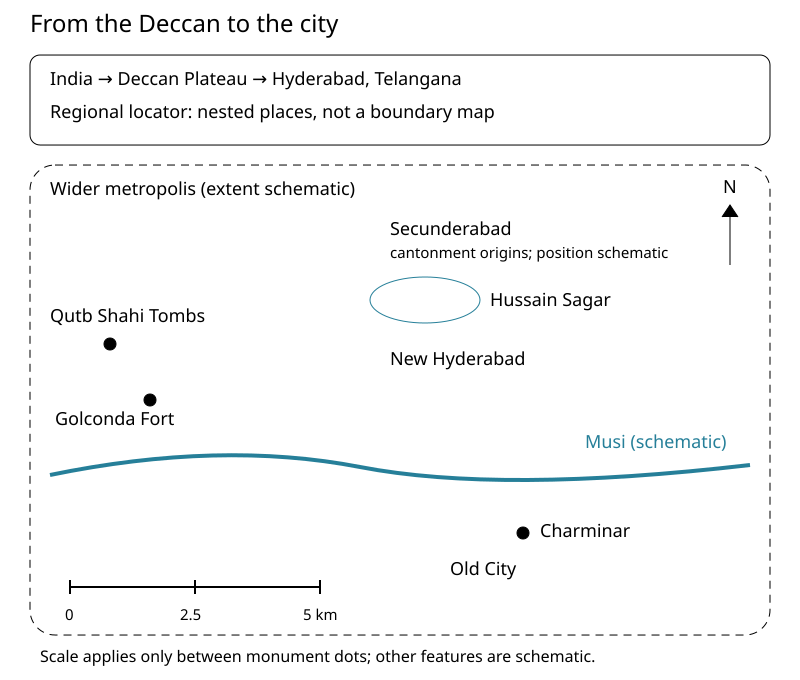

Imagine starting at Charminar and asking where the older capital was. Charminar marks Hyderabad's foundation in 1591, but Golconda Fort was already a Qutb Shahi capital to its west.[^src:lib-unesco-the-qutb-shahi-monuments-of-hyderabad] A useful visitor's map therefore needs two dimensions: where places lie, and when they became important.

By the end, aim to sketch the city's main historical centres and explain why **Hyderabad city**, **Hyderabad State**, and **Telangana** are not interchangeable names.

## 1. Zoom out: a city within the Deccan

Hyderabad lies in India's Deccan Plateau; today it is the capital of Telangana, the state created on 2 June 2014.[^src:lib-encyclopedia-hyderabad-encyclopedia-com][^src:lib-wikipedia-history-of-hyderabad#1956-present] The Deccan is the regional setting, not another name for the city or for the former Hyderabad State.[^src:lib-encyclopedia-hyderabad-encyclopedia-com]

Use three different questions when reading a place name: **Which region? Which political territory? Which urban place?** For example, “Charminar in Hyderabad” identifies a monument in a city; “Hyderabad State under the Nizams” identifies a much larger territory governed by a dynasty.[^src:lib-unesco-the-qutb-shahi-monuments-of-hyderabad][^src:lib-wikipedia-hyderabad-state]

<!-- media:visual-1 -->

*Original orientation drawing. Monument dots use the UNESCO nomination's coordinates, converted to approximate local distances; their scale is not a road-distance scale. The river, lake, urban zones, and outer outline are schematic, not surveyed boundaries. Regional setting and urban relationships follow Karen Leonard's account.*[^src:lib-unesco-the-qutb-shahi-monuments-of-hyderabad][^src:lib-encyclopedia-hyderabad-encyclopedia-com]

Try tracing the three monument dots before following the river. Which two dots form a close pair, and which stands apart?

## 2. Read the city through its river and centres

The **Musi River** is a useful historical dividing line. Karen Leonard describes old Hyderabad as the sixteenth-century walled city south of the river, newer Hyderabad north of it, and **Secunderabad** farther north, beyond **Hussain Sagar lake**, developing from a British cantonment—a military station.[^src:lib-encyclopedia-hyderabad-encyclopedia-com] These are historical zones, not a complete map of present municipal boundaries.

**Charminar** anchors the Old City. **Golconda Fort** lies to its west, with the **Qutb Shahi Tombs** northwest of the fort; the nomination's coordinates place Charminar southeast of Golconda.[^src:lib-unesco-the-qutb-shahi-monuments-of-hyderabad] Keep the fort and the new city distinct: Muhammad Quli Qutb Shah laid out Hyderabad beside the Musi as overcrowding and irregular water supply made Golconda less convenient for urban life.[^src:lib-iranicaonline-hyderabad-encyclopaedia]

:::example
**Build a mental journey, not a walking route.** Begin with the fort and nearby royal tombs in the west. Move east and somewhat south to Charminar in the Old City, then think north across the Musi into newer Hyderabad, and farther north beyond Hussain Sagar to Secunderabad.[^src:lib-unesco-the-qutb-shahi-monuments-of-hyderabad][^src:lib-encyclopedia-hyderabad-encyclopedia-com] This sequence connects distinct centres; it does not establish safe walking distances or current transport options.
:::

The river also helps explain change rather than merely direction. The devastating Musi flood of 1908 prompted flood-prevention planning, and Osman Sagar and Himayat Sagar reservoirs were subsequently built west of the city.[^src:lib-wikipedia-history-of-hyderabad#asaf-jah-vi][^src:lib-wikipedia-history-of-hyderabad#asaf-jah-vii]

[Watch: Hyderabad in the Early 20th Century — Anuradha Naik, TEDx Talks](https://www.youtube.com/watch?v=G5xEgqG2HrA)

*No transcript is available; this is an optional watch-only companion, not evidence for the account above.*

While watching, look for how photographs or plans connect water and urban buildings. Make your own observation rather than treating the video as a dated map of today's city.

## 3. Keep the city when the state changes

The princely **Hyderabad State** was ruled by the Asaf Jahi Nizams from 1724 to 1948. Its capital was initially Aurangabad; Hyderabad city became its capital in 1763.[^src:lib-wikipedia-hyderabad-state] This alone shows why the state and city cannot mean the same thing: a political territory can move its capital without becoming a different city.

Under British influence, Hyderabad remained a princely state rather than a directly administered British province; British alliances, a Resident, and a cantonment nevertheless shaped its politics and urban development.[^src:lib-encyclopedia-hyderabad-encyclopedia-com] “Not directly ruled” does not mean “free of outside power.”

Indian military intervention in 1948 brought the state into the Indian Union. Hyderabad State then continued within India until its 1956 reorganisation; Hyderabad city became Andhra Pradesh's capital while other parts of the former territory went elsewhere.[^src:lib-encyclopedia-hyderabad-encyclopedia-com][^src:lib-wikipedia-history-of-hyderabad#hyderabad-state] Telangana's formation in 2014 was a later transition, not the restoration of all the former princely state's territory.[^src:lib-wikipedia-history-of-hyderabad#1956-present][^src:lib-wikipedia-hyderabad-state]

:::example
**Read a historical sentence in three steps.** “Hyderabad was incorporated into India in 1948” needs clarification.

1. Identify the event: incorporation of a political territory, not the founding of an urban settlement.[^src:lib-encyclopedia-hyderabad-encyclopedia-com]
2. Supply the missing noun: **Hyderabad State**.
3. Contrast the timescales: Hyderabad city had a founding landmark in 1591, centuries before that incorporation.[^src:lib-unesco-the-qutb-shahi-monuments-of-hyderabad]

Now complete this sentence yourself: “In 1956, Hyderabad ___ became a capital, while the former Hyderabad ___ was divided.”[^src:lib-encyclopedia-hyderabad-encyclopedia-com]
:::

## 4. Put surviving places on the timeline

Use **1591 → 1687 → 1724 → 1948 → 1956 → 2014** as a first scaffold: new city and Charminar, Mughal conquest, Asaf Jahi emergence, Indian incorporation, state reorganisation, and Telangana's formation.[^src:lib-unesco-the-qutb-shahi-monuments-of-hyderabad][^src:lib-iranicaonline-hyderabad-encyclopaedia][^src:lib-encyclopedia-hyderabad-encyclopedia-com][^src:lib-wikipedia-history-of-hyderabad#1956-present] These dates label different kinds of change; they are not six city-foundation dates.

Pair each broad era with something visible or recognisable:

| Historical layer | Place or institution to connect with it |
| --- | --- |
| Qutb Shahi rule, 1518–1687 | Golconda Fort, the royal tombs, and Charminar, built in 1591.[^src:lib-unesco-the-qutb-shahi-monuments-of-hyderabad] |
| Mughal conquest, 1687 | Golconda's changed political ownership; the older monuments did not acquire a new construction date.[^src:lib-iranicaonline-hyderabad-encyclopaedia] |
| Nizam-era capital | Palaces and public institutions; Osmania University was founded in 1918.[^src:lib-encyclopedia-hyderabad-encyclopedia-com] |
| Later metropolitan growth | HITEC City launched in the 1990s; Metro operations began in 2017.[^src:lib-wikipedia-history-of-hyderabad#1956-present] |

The interactive timeline below lets you compare these political turns with landmark milestones. Its era bands simplify transitions: Asaf Jah's authority in 1724 was autonomous provincial power that still recognised formal Mughal suzerainty, not an instantaneous break with every Mughal institution.[^src:lib-iranicaonline-hyderabad-encyclopaedia]

:::deeper{title="A source has a date, too"}
The Qutb Shahi nomination was submitted to UNESCO's Tentative List in 2010 and calls Hyderabad Andhra Pradesh's capital.[^src:lib-unesco-the-qutb-shahi-monuments-of-hyderabad] Read that wording in its historical context, alongside Telangana's 2014 formation.[^src:lib-wikipedia-history-of-hyderabad#1956-present] A Tentative List nomination is not proof of World Heritage inscription.[^src:lib-unesco-the-qutb-shahi-monuments-of-hyderabad]
:::

## Check yourself

Try without looking back.

1. Where are the Old City and Secunderabad relative to the Musi and Hussain Sagar?
2. Is Golconda east or west of Charminar? Where are the royal tombs relative to the fort?
3. Why is “Hyderabad State was founded in 1591” misleading?
4. Fill the two blanks in the 1956 sentence above.
5. Why can a 2010 source call Hyderabad Andhra Pradesh's capital without settling its present status?

:::deeper{title="Answers"}
1. Old City is south of the Musi; Secunderabad is north of Hussain Sagar.[^src:lib-encyclopedia-hyderabad-encyclopedia-com]
2. Golconda is west of Charminar; the tombs are northwest of the fort.[^src:lib-unesco-the-qutb-shahi-monuments-of-hyderabad]
3. 1591 marks the new city and Charminar; the Asaf Jahi state dates from 1724.[^src:lib-unesco-the-qutb-shahi-monuments-of-hyderabad][^src:lib-wikipedia-hyderabad-state]
4. **City; State.** The city became Andhra Pradesh's capital while the state's territory was divided.[^src:lib-encyclopedia-hyderabad-encyclopedia-com]
5. Political arrangements changed: Telangana was created in 2014 with Hyderabad as its capital.[^src:lib-wikipedia-history-of-hyderabad#1956-present]
:::

## Key takeaways

- Locate Hyderabad within the Deccan, then distinguish city from political territory.[^src:lib-encyclopedia-hyderabad-encyclopedia-com]
- Use the Musi and Hussain Sagar to connect Old City, newer Hyderabad, and Secunderabad.[^src:lib-encyclopedia-hyderabad-encyclopedia-com]
- Golconda and Charminar represent related but spatially distinct Qutb Shahi centres.[^src:lib-unesco-the-qutb-shahi-monuments-of-hyderabad]
- A change of state boundaries is not a new foundation of the city.[^src:lib-encyclopedia-hyderabad-encyclopedia-com]

For a weekend exercise, redraw the orientation sketch on paper and add three dated landmark labels. Next, we move behind the 1591 foundation to the Deccan and Golconda.

[^src:lib-encyclopedia-hyderabad-encyclopedia-com]: Karen Leonard, *Hyderabad*, Encyclopedia.com, overview, “Deccani and Mughal Origins,” “The Influence of British India,” and “Present-Day Hyderabad.”
[^src:lib-unesco-the-qutb-shahi-monuments-of-hyderabad]: UNESCO World Heritage Centre, *The Qutb Shahi Monuments of Hyderabad: Golconda Fort, Qutb Shahi Tombs, Charminar*, India's Tentative List submission (2010), description and coordinates.
[^src:lib-iranicaonline-hyderabad-encyclopaedia]: Gavin R. G. Hambly, *Hyderabad*, Encyclopaedia Iranica, “History,” updated 2013.
[^src:lib-wikipedia-hyderabad-state]: Wikipedia contributors, *Hyderabad State*, introductory overview and capital chronology.
[^src:lib-wikipedia-history-of-hyderabad#asaf-jah-vi]: Wikipedia contributors, *History of Hyderabad*, “Asaf Jah VI.”
[^src:lib-wikipedia-history-of-hyderabad#asaf-jah-vii]: Wikipedia contributors, *History of Hyderabad*, “Asaf Jah VII.”
[^src:lib-wikipedia-history-of-hyderabad#hyderabad-state]: Wikipedia contributors, *History of Hyderabad*, post-independence “Hyderabad State.”
[^src:lib-wikipedia-history-of-hyderabad#1956-present]: Wikipedia contributors, *History of Hyderabad*, “1956–present.”

<!-- media:visual-2 -->
::visual{src="../visuals/hyderabad-timeline.json" title="Political turns and surviving landmarks"}
