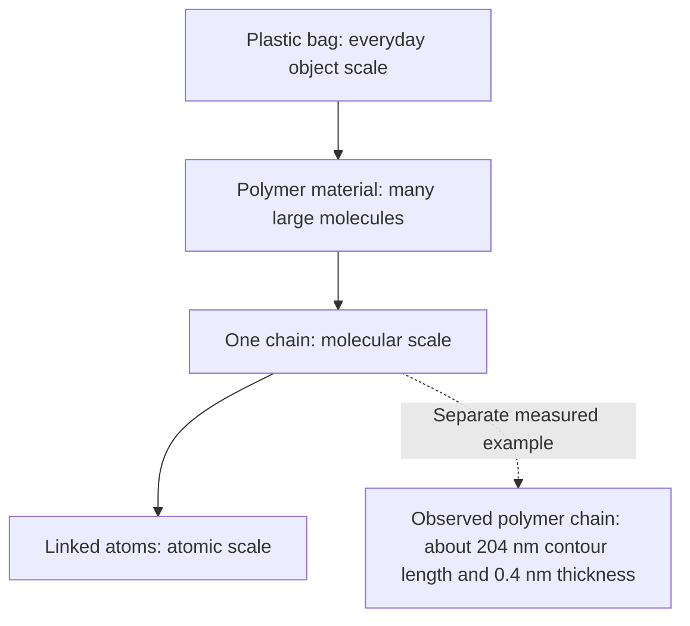

Pick up a plastic bag and imagine being able to zoom into its material. Plastic bags make a useful starting point for exploring polymers: the Royal Society of Chemistry uses them as an everyday example.[^src:lib-rsc-properties-of-polymers-resource-rsc] What would we need to recognise before a molecular picture could make sense?

> **Incomplete draft:** The explanations and practice for water formulas, the definition of a molecule, and mixtures still need verified introductory textbook coverage. Do not use this chapter as a completed foundation lesson yet.

## From an object to its molecular building blocks

A polymer consists of very large molecules containing many repeating subunits.[^src:lib-wikipedia-polymer] In the introductory chain model, atoms within each polymer molecule are linked to other atoms by covalent bonds.[^src:lib-rsc-properties-of-polymers-resource-rsc] We will explore what those bonds mean in the next chapter; for now, notice the distinction between a whole material, a chain molecule and its atoms.

<!-- media:visual-1 -->

Original conceptual diagram based on the RSC bag example and the polymer overview. Not to scale. The dimensions belong to the particular chain described in the microscopy caption, not to every polymer or to a measured chain from this bag.[^src:lib-rsc-properties-of-polymers-resource-rsc][^src:lib-wikipedia-polymer]

The polymer overview describes actual linear chains observed using an atomic force microscope on a surface under liquid. Its caption reports a contour length of about 204 nm and a thickness of about 0.4 nm.[^src:lib-wikipedia-polymer] That observation gives us evidence for molecular chains rather than just a bead-string analogy; the diagram above is an explanation, not a microscope image.

:::example
**Reading the zoom diagram**

Start at the bag and move down one arrow at a time. At the material level, we are considering many molecules; at the chain level, we are considering one large molecule; at the final level, we are considering linked atoms within it.[^src:lib-rsc-properties-of-polymers-resource-rsc][^src:lib-wikipedia-polymer] The arrows change our level of description—they do not represent a chemical reaction.
:::

## Elements and compounds: two different questions

:::definition
An **element** is a substance consisting of only one type of atom. A **compound** contains two or more elements chemically combined.[^src:lib-rsc-properties-of-polymers-resource-rsc]
:::

These definitions ask about the kinds of atoms and whether different elements are chemically combined—not about whether the object is large or small.[^src:lib-rsc-properties-of-polymers-resource-rsc] Keep the distinction in mind when looking at a long chain: its length alone cannot tell you whether it contains one element or several.

:::example
**Classify a description before naming a material**

A description says, “This substance contains only one type of atom.” That matches the definition of an element. Another says, “Two different elements are chemically combined.” That matches the definition of a compound.[^src:lib-rsc-properties-of-polymers-resource-rsc]

Now complete the missing step: “Three different elements chemically combined” describes a ______. Explain which part of the definition you used.
:::

[Watch: Khan Academy — Elements and atoms](https://www.youtube.com/watch?v=IFKnq9QM6_A)

*No transcript is available; this optional video is for watching only.*

<!-- media:visual-2 unavailable: the available foundation text is a catalog record; no verified mixture definition or particle-picture evidence is present in the supplied teaching passages -->
*The particle comparison will be added when the introductory explanations for mixtures can be verified.*

## What remains before formula practice

The next step is to connect water and carbon examples to symbols, atom counts and particle pictures. That section is not ready: the available introductory chemistry material describes a textbook but does not supply the explanations needed to verify the worked lesson. Water-formula counting, mixture classification and the plastic-object formula example are therefore deliberately left unfinished rather than presented as established instruction.

## Check yourself

Try these without looking back. They check only the completed material, not readiness to move on.

1. What distinguishes an element from a compound?
2. Complete the faded example: three different elements chemically combined describe what?
3. In the zoom diagram, how does the material level differ from the single-chain level?
4. Do the quoted microscope dimensions establish the dimensions of every polymer chain? Why not?

:::deeper{title="Answers"}
1. An element consists of one type of atom; a compound contains two or more elements chemically combined.[^src:lib-rsc-properties-of-polymers-resource-rsc]
2. A compound: “two or more” includes three.[^src:lib-rsc-properties-of-polymers-resource-rsc]
3. The material contains many large molecules; the single-chain view selects one molecule.[^src:lib-wikipedia-polymer]
4. No. The caption identifies the dimensions of the particular polymer shown, not a universal chain size.[^src:lib-wikipedia-polymer]
:::

## Key takeaways

- Distinguish a whole polymer material from one of its large molecules.[^src:lib-wikipedia-polymer]
- An element contains only one type of atom.[^src:lib-rsc-properties-of-polymers-resource-rsc]
- A compound contains different elements chemically combined.[^src:lib-rsc-properties-of-polymers-resource-rsc]
- Complete the missing formula and mixture practice before treating this foundation as finished.

Once those foundations are complete, we can examine bonds inside molecules and attractions between them.

[^src:lib-rsc-properties-of-polymers-resource-rsc]: Royal Society of Chemistry, *Properties of polymers*, resource introduction and curriculum specifications.
[^src:lib-wikipedia-polymer]: Wikipedia contributors, *Polymer*, opening definition and atomic-force-microscopy figure caption.
