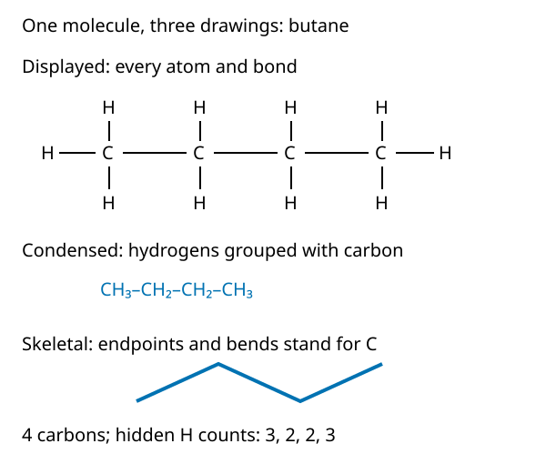
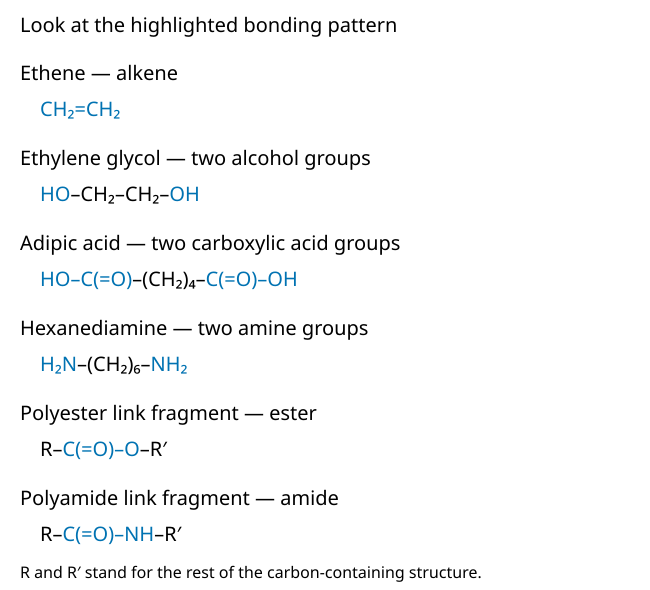

# Carbon structures and reactive groups

Put a bottle and a piece of cloth beside your notebook. How could a drawing help us understand the chemistry behind a material? PET is a polyester and nylon-6,6 is a polyamide: recognizing their ester and amide links starts with reading the atoms and bonds correctly.[^src:lib-libretexts-2-3-step-growth-and-chain-growth]

Our question is: **what information can you recover from a small molecular drawing?** Work with paper and pencil only; no chemical tests or synthesis are needed. Before starting, check that you can read a single bond as one shared electron pair and a double bond as two bond lines.[^src:lib-chemguide-how-to-draw-organic-molecules]

## One molecule, three ways to draw it

A molecular formula counts atoms; a structural formula tells us how they are connected. For example, butane has molecular formula $C_4H_{10}$, but that count alone does not describe its connectivity.[^src:lib-chemguide-how-to-draw-organic-molecules]

A **displayed formula** draws every atom and bond. A **condensed formula** groups hydrogens with their carbon, as in `CH₃–CH₂–CH₂–CH₃`. A **skeletal formula**, also called a line structure, leaves carbon symbols and carbon-bound hydrogens implicit.[^src:lib-chemguide-how-to-draw-organic-molecules]

<!-- media:visual-1 -->

Original teaching redraw of the drawing conventions described by Jim Clark and Western Oregon University; the connections do not change between rows.[^src:lib-chemguide-how-to-draw-organic-molecules][^src:lib-wou-ch105-chapter-5-introduction-to-organic]

These drawings communicate connectivity, not a literal flat molecular shape. A displayed drawing with right angles does not mean methane or another carbon compound actually has that shape.[^src:lib-wou-ch105-chapter-5-introduction-to-organic]

**Try it:** cover two rows and reconstruct them from the remaining row. Check that you have not changed which carbons are neighbors.

## Recover the hidden atoms

In a skeletal drawing, each unlabeled endpoint and bend stands for a carbon. An explicitly labeled atom such as O occupies its own position: do not add a carbon there. Oxygen, nitrogen and other heteroatoms remain visible, along with hydrogens attached to them.[^src:lib-chemguide-how-to-draw-organic-molecules][^src:lib-wou-ch105-chapter-5-introduction-to-organic]

For the ordinary neutral carbon structures here, supply enough hydrogens to make four bonds at each carbon. Count a double bond as two toward that total.[^src:lib-chemguide-how-to-draw-organic-molecules]

:::example
**Worked example: recover butane from the zigzag.**

1. Count two endpoints and two bends: four carbons.
2. Each end carbon has one C–C bond. It therefore needs three C–H bonds.
3. Each inner carbon has two C–C bonds. It therefore needs two C–H bonds.
4. Read along the chain: `CH₃–CH₂–CH₂–CH₃`. Adding the hydrogens gives $3+2+2+3=10$.

This is an application of the skeletal-drawing rules, not a change to the molecule.[^src:lib-chemguide-how-to-draw-organic-molecules]
:::

**Now finish one:** in `CH₂=CH–CH₃`, the middle carbon has a double bond on one side and a single bond on the other. How many hydrogens does it need? Use four minus the bond total before looking at the written H.[^src:lib-chemguide-how-to-draw-organic-molecules]

In the Visuals tab, step through **One chain, three drawing conventions**. The shorter ethane chain lets you see every atom at once; pause on its skeletal version and predict the hidden hydrogens before revealing the answer.[^src:lib-chemguide-how-to-draw-organic-molecules]

## Recognize patterns, not isolated letters

:::definition
A **functional group** is a specific bonding arrangement within a molecule with characteristic chemical behavior. Similar groups often react similarly, although the rest of the molecule can matter.[^src:lib-openstax-3-1-functional-groups-organic][^src:lib-wou-ch105-chapter-5-introduction-to-organic]
:::

Start by looking for C=C, then O and N, then check whether a C=O lies directly beside them. **Carbonyl** means the C=O group; it is not the same thing as an alkene's C=C.[^src:lib-openstax-3-1-functional-groups-organic]

Here, R and R′ stand for the remaining carbon-containing parts of a structure; they are placeholders, not element symbols, and need not be identical.[^src:lib-wou-ch105-chapter-5-introduction-to-organic][^src:lib-chemistry-identifying-functional-groups#t0]

| Group | Pattern to recognize | Important boundary |
|---|---|---|
| Alkene | C=C | The double bond joins two carbons. |
| Alcohol | R–CH₂–OH, for example | The OH here is not attached to a carbonyl carbon. |
| Carboxylic acid | R–C(=O)–OH | Include both the carbonyl and OH. |
| Amine | R–NH₂, for example | N is not directly bonded to a carbonyl carbon. |
| Ester | R–C(=O)–O–R′ | The singly bonded oxygen continues to another carbon-containing group. |
| Amide | R–C(=O)–NH₂, for example | N is directly bonded to the carbonyl carbon. |

These are recognition patterns and simple examples, not an exhaustive list of possible substitutions.[^src:lib-openstax-3-1-functional-groups-organic][^src:lib-wou-ch105-chapter-5-introduction-to-organic]

:::example
**Compare two oxygen-containing structures.**

In `CH₃–CH₂–OH`, the OH is attached to a non-carbonyl carbon: an alcohol. In `CH₃–C(=O)–OH`, it is directly attached to the carbonyl carbon: a carboxylic acid. Do not label the acid's OH as a separate alcohol group; recognize the whole acid pattern.[^src:lib-openstax-3-1-functional-groups-organic][^src:lib-chemistry-identifying-functional-groups#t0]
:::

Watch how the instructor searches a larger drawing for C=C and alcohol groups, then distinguishes carboxylic acid and ester groups in aspirin. Pause before each label and make your own prediction.[^src:lib-chemistry-identifying-functional-groups#t0]

[Watch Khan Academy's functional-group identification walkthrough from 0:00](https://www.youtube.com/watch?v=esJ5MbAHswc&t=0s)

## Find the groups that matter for polymers

Ethylene glycol has two alcohol groups; adipic acid has two carboxylic acid groups; hexanediamine has two amine groups. These examples help us see how a molecule can have a reactive group at each end.[^src:lib-libretexts-2-3-step-growth-and-chain-growth]

<!-- media:visual-2 -->

Original teaching redraw: highlighted atoms identify the functional groups. The ester and amide rows are link fragments, not complete PET or nylon repeat units; `(CH₂)₄` means four consecutive CH₂ groups.[^src:lib-openstax-3-1-functional-groups-organic][^src:lib-wou-ch105-chapter-5-introduction-to-organic][^src:lib-libretexts-2-3-step-growth-and-chain-growth]

In the acid-plus-alcohol condensation example, joining produces an ester link; acid plus amine produces an amide link. Nylon-6,6 illustrates polyamide formation, while PET illustrates a polyester; detailed reaction routes come later.[^src:lib-libretexts-2-3-step-growth-and-chain-growth]

**Avoid two tempting shortcuts:** not every O–H is an alcohol group, and not every nitrogen indicates an amine. Check direct neighbors, especially the carbonyl carbon.[^src:lib-chemistry-identifying-functional-groups#t0]

In the Visuals tab, use **Compare functional groups** to select each of the six groups. Compare the highlighted pattern with its partner, then explain which direct bond makes the classification different. The unhighlighted R portion is only context.[^src:lib-openstax-3-1-functional-groups-organic]

## Check yourself

Try these without looking back, then open the answers.

1. Why is a molecular formula insufficient to reconstruct a structural drawing?
2. On a three-segment carbon zigzag, how many carbons are present, and how do you recover the hydrogen counts?
3. What direct connection distinguishes an amide from an amine?
4. **Worked problem:** expand `HO–CH₂–CH₂–OH` into a drawing showing every bond. Count C, H and O; circle the functional groups and explain why it is not a carboxylic acid.

:::deeper{title="Answers"}
1. It counts atoms but does not specify their connections.[^src:lib-chemguide-how-to-draw-organic-molecules]
2. Four carbons: two ends plus two bends. With single C–C bonds only, the hydrogen counts are 3, 2, 2, 3.[^src:lib-chemguide-how-to-draw-organic-molecules]
3. An amide N is directly bonded to a carbonyl carbon; an amine N is not.[^src:lib-openstax-3-1-functional-groups-organic]
4. Draw the chain H–O–C–C–O–H and attach two H atoms to each C. Counts: two C, six H and two O, giving $C_2H_6O_2$. Circle each terminal OH with its adjacent carbon as an alcohol pattern; there is no C=O and therefore no carboxylic acid group. This is ethylene glycol, the two-alcohol monomer example.[^src:lib-libretexts-2-3-step-growth-and-chain-growth][^src:lib-wou-ch105-chapter-5-introduction-to-organic]
:::

For your annotated sketch, draw the worked-problem molecule in displayed and skeletal forms. Label what you omitted in the skeletal version. Move on when you can recover the atoms and justify the group labels without copying.

## Key takeaways

- Changing drawing conventions does not change connectivity.[^src:lib-chemguide-how-to-draw-organic-molecules]
- Skeletal endpoints and bends imply carbon; carbon-bound hydrogens are recovered from bond counts.[^src:lib-wou-ch105-chapter-5-introduction-to-organic]
- Functional groups are bonding patterns, not merely the presence of O or N.[^src:lib-openstax-3-1-functional-groups-organic]
- Look for C=O before deciding between alcohol and acid, or amine and amide.[^src:lib-chemistry-identifying-functional-groups#t0]

Next, we will track these atoms through reactions and learn how to count molecules using moles.

[^src:lib-chemguide-how-to-draw-organic-molecules]: Jim Clark, *How to draw organic molecules*, Chemguide, displayed and skeletal formulae.
[^src:lib-wou-ch105-chapter-5-introduction-to-organic]: Western Oregon University, *CH105: Chapter 5 — Introduction to Organic Chemistry*, sections 5.3 and 5.6.
[^src:lib-openstax-3-1-functional-groups-organic]: OpenStax, *Organic Chemistry*, section 3.1, “Functional Groups.”
[^src:lib-libretexts-2-3-step-growth-and-chain-growth]: Christopher Schaller, *Polymer Chemistry*, Chemistry LibreTexts, section 2.3, “Step Growth and Chain Growth,” monomer and condensation examples.
[^src:lib-chemistry-identifying-functional-groups#t0]: Khan Academy Organic Chemistry, *Identifying functional groups*, walkthrough beginning at 0:00.

<!-- media:visual-3 -->
::visual{src="../visuals/03-conventions.json" title="One chain, three drawing conventions"}

<!-- media:visual-4 -->
::visual{src="../visuals/03-groups.html" poster="../visuals/03-groups.svg" title="Compare functional groups"}
