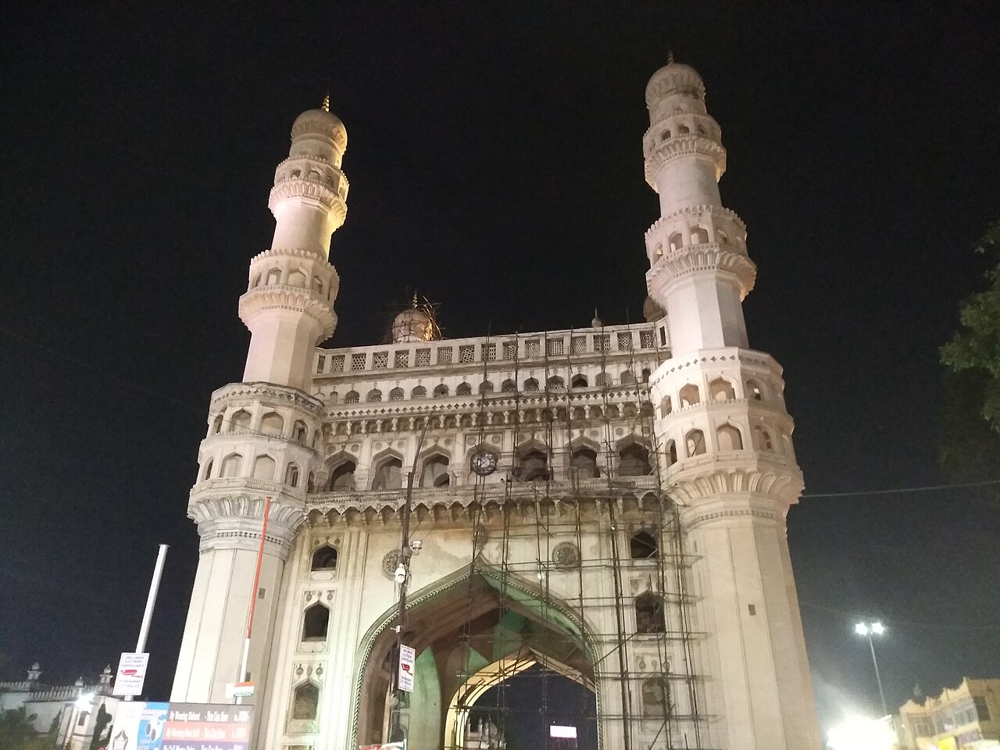

Imagine approaching a monument and being asked, “What does this tell you about the city?” Before reaching for a date or a dynasty, look closely. We will practise separating what a photograph shows from what historical evidence lets us say.

## First look: a monument in a living street

Charminar stands in Hyderabad's Old City; the nearby Laad Bazaar is a market known for bangles.[^src:lib-incredibleindia-famous-places-to-explore-in] Look at the photograph before reading its history: trace the tall corner towers, the large arched openings and the activity around the building. Try to identify the four-minaret arrangement, but do not assume every tower is equally visible from one viewpoint.[^src:lib-unesco-the-qutb-shahi-monuments-of-hyderabad]

<!-- media:image-1 -->

*Notice the contrast between the monument's tall forms and the street at its feet. Credit: Rashid Jorvee, own work, CC BY-SA 4.0, [Wikimedia Commons](https://commons.wikimedia.org/wiki/File:Charminar-Hyderabad-Monument.jpg). Photograph date is not established in the supplied metadata.*

:::example
**Observation → question → verification**

1. **Observation:** point to one arch and describe its shape without giving it a date.
2. **Question:** was the building intended to organise the city around it?
3. **Verification:** India's UNESCO submission describes Charminar at the crossing of two arterial axes, with four gateways oriented towards the cardinal directions, and as a reference point for the city's planning grid.[^src:lib-unesco-the-qutb-shahi-monuments-of-hyderabad]

Now try a second observation about street activity. What additional evidence would you need before claiming that the same activity occurred here in 1591?
:::

The submission identifies mortared stone and carved stucco among the monuments' materials and describes repairs to Charminar's stucco over time.[^src:lib-unesco-the-qutb-shahi-monuments-of-hyderabad] A photograph helps you recognise surfaces and ornament; it cannot by itself tell you which patches are original or repaired.

## A date is evidence, not something you can see

Muhammad Quli Qutb Shah founded Hyderabad in 1591, with Charminar as its centrepiece.[^src:lib-wikipedia-history-of-hyderabad] The UNESCO submission says contemporary Persian historical texts record Charminar's construction in 1591, even though the monument lacks a foundation inscription.[^src:lib-unesco-the-qutb-shahi-monuments-of-hyderabad] Thus “large arches” is a visual observation, whereas “built in 1591” is a historically supported statement.

Why create a new city outside Golconda? The encyclopedia reports water shortages and, separately, architectural historian Pushkar Sohoni's interpretation that growth and changing settlement needs encouraged separation from the fortified centre.[^src:lib-wikipedia-history-of-hyderabad] Keep these as attributed explanations rather than making one photograph prove a single motive.

:::deeper{title="Read the heritage description critically"}
The UNESCO page is India's 2010 Tentative List submission, not evidence that these monuments are inscribed World Heritage Sites.[^src:lib-unesco-the-qutb-shahi-monuments-of-hyderabad] Its arguments explain why the monuments deserve recognition, so evaluative language should be read as nomination advocacy. Its references to Hyderabad as Andhra Pradesh's capital reflect its historical context; Telangana was created in 2014 with Hyderabad as its capital.[^src:lib-wikipedia-history-of-hyderabad]
:::

## Find your bearings: region, river and landmarks

Begin at two scales: Hyderabad is a city in Telangana, while the Deccan is the wider regional setting of its history.[^src:lib-wikipedia-history-of-hyderabad] At city scale, Charminar anchors the Old City and Golconda lies to the west; the tombs lie farther north-west of the fort.[^src:lib-unesco-the-qutb-shahi-monuments-of-hyderabad] The founding account places the new city by the Musi and describes Purana Pul, the old bridge, as enabling travel between Golconda and Hyderabad.[^src:lib-wikipedia-history-of-hyderabad]

Secunderabad adds a later layer: British troops were stationed there while the Nizam continued to rule Hyderabad State.[^src:lib-wikipedia-history-of-hyderabad] **Uncertain:** the supplied textual passages do not establish its exact position relative to the Musi, or the detailed river course. Its northern placement in the orientation story is provisional; verify it on a detailed map before using it for navigation.

In **Find your bearings**, select the landmark scenes. Before revealing Golconda, predict which direction it lies from the old urban centre; then compare its role with Charminar's. The river line and landmark positions are schematic, and no political boundary is implied.[^src:lib-unesco-the-qutb-shahi-monuments-of-hyderabad][^src:lib-wikipedia-history-of-hyderabad]

## One name, different scales: city and state

Hyderabad city and Hyderabad State are not interchangeable. The encyclopedia distinguishes the Nizam's state of 1724–1948 from the city that became its capital and from the succeeding Indian state of 1948–1956.[^src:lib-wikipedia-hyderabad-state] Think of a capital as one place within a larger political territory, not as the whole territory.

:::example
**Repair a misleading sentence:** “Hyderabad began in 1724.”

First ask what “Hyderabad” means here. If it means the city, use **1591**; if it means Asaf Jahi power in the Deccan, **1724** is the relevant milestone.[^src:lib-wikipedia-history-of-hyderabad] A clearer sentence is: “Hyderabad city was founded in 1591; Asaf Jahi rule began in 1724.”[^src:lib-wikipedia-history-of-hyderabad]

Your turn: repair “Hyderabad disappeared in 1956.” Identify what was reorganised and what remained a city.[^src:lib-wikipedia-history-of-hyderabad]
:::

| Milestone | What changed? |
| --- | --- |
| 1591 | Hyderabad city founded around Charminar.[^src:lib-wikipedia-history-of-hyderabad] |
| 1687 | Golconda conquered by the Mughals; Mughal administration followed.[^src:lib-wikipedia-history-of-hyderabad] |
| 1724 | Asaf Jah I established autonomy in the Deccan.[^src:lib-wikipedia-history-of-hyderabad] |
| 1948 | Hyderabad State incorporated into India following Indian military intervention.[^src:lib-wikipedia-history-of-hyderabad] |
| 1956 | Hyderabad State's territory divided during linguistic reorganisation; the city became Andhra Pradesh's capital.[^src:lib-wikipedia-history-of-hyderabad] |
| 2014 | Telangana created on 2 June, with Hyderabad as its capital.[^src:lib-wikipedia-history-of-hyderabad] |

Use **One city, changing political settings** to step between these milestones. Predict “city foundation,” “regional rule,” or “state change” before reading each event. Notice especially the interval between 1687 and 1724: conquest did not immediately produce Nizam rule.[^src:lib-wikipedia-history-of-hyderabad]

The 1948 entry is only an orientation marker, not a complete account of conflict or civilian experience. We will return to the event with more carefully compared accounts later.

## Make a small field-reading card

Spend ten minutes making a card headed **Charminar: observe, interpret, verify**. Add three visible observations, one historical claim with its source, one question the photograph cannot answer, and a six-date timeline. Finish with two separate sentences explaining Hyderabad city and Hyderabad State.

<!-- media:video-1 unavailable: No verified authoritative English video met the narrated monument-observation and city-orientation brief; no registered transcript moment is available. -->
*No narrated video accompanies this introduction: a suitable authoritative English walkthrough has not been verified. Use the photograph for the observation exercise.*

## Check yourself

1. Why does a visible arch not establish a construction date?
2. Where is Golconda relative to Hyderabad's centre, and what river appears in the founding account?
3. What is wrong with calling 1724 the foundation date of Hyderabad city?
4. How do 1948, 1956 and 2014 describe different changes?

:::deeper{title="Answers"}
1. Shape is observable; dating needs historical evidence. For Charminar, the submission points to contemporary Persian texts.[^src:lib-unesco-the-qutb-shahi-monuments-of-hyderabad]
2. Golconda lies west; the river is the Musi.[^src:lib-unesco-the-qutb-shahi-monuments-of-hyderabad][^src:lib-wikipedia-history-of-hyderabad]
3. The city was founded in 1591; 1724 marks Asaf Jahi power.[^src:lib-wikipedia-history-of-hyderabad]
4. Incorporation of Hyderabad State into India; linguistic reorganisation; creation of Telangana. None is a new founding of Hyderabad city.[^src:lib-wikipedia-history-of-hyderabad]
:::

## Key takeaways

- Start with observation, then verify historical interpretation.
- Charminar belongs to the city's 1591 Qutb Shahi foundation.[^src:lib-unesco-the-qutb-shahi-monuments-of-hyderabad]
- Connect the Old City, Golconda and the Musi before adding later urban layers.[^src:lib-unesco-the-qutb-shahi-monuments-of-hyderabad][^src:lib-wikipedia-history-of-hyderabad]
- Always specify whether “Hyderabad” means the city or a historical state.[^src:lib-wikipedia-hyderabad-state]

Next, we move back before the city's foundation to understand Golconda and its Deccan setting.

[^src:lib-unesco-the-qutb-shahi-monuments-of-hyderabad]: India, *The Qutb Shahi Monuments of Hyderabad: Golconda Fort, Qutb Shahi Tombs, Charminar*, UNESCO World Heritage Centre Tentative List submission (2010), Description and Statements of authenticity and/or integrity.
[^src:lib-wikipedia-history-of-hyderabad]: Wikipedia contributors, *History of Hyderabad*, introduction, Founding of Hyderabad, Mughal conquest and rule, The Nizams of Hyderabad, and modern history.
[^src:lib-wikipedia-hyderabad-state]: Wikipedia contributors, *Hyderabad State*, introduction and historical overview.
[^src:lib-incredibleindia-famous-places-to-explore-in]: Ministry of Tourism, *Famous Places to Explore in Hyderabad*, Incredible India, Tourist attractions.

<!-- media:visual-1 -->
::visual{src="../visuals/meet-charminar-map.html" poster="../visuals/meet-charminar-map.svg" title="Find your bearings"}

<!-- media:visual-2 -->
::visual{src="../visuals/meet-charminar-timeline.json" title="One city, changing political settings"}
