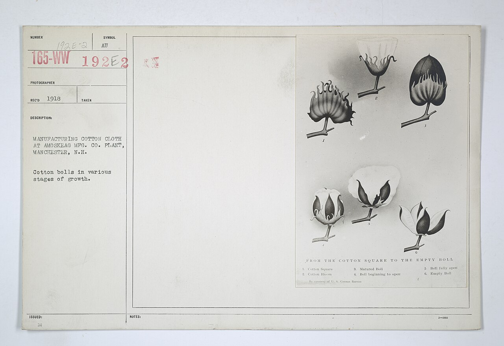

Think of a shopping bag, a drinks bottle and a piece of cotton cloth. What would you need to see to explain their materials—not just their shapes? We will move from objects you can hold to molecules and then atoms, keeping those scales separate.

## Familiar materials, including natural ones

Polyethylene (PE) is used in packaging bags and films; polyethylene terephthalate (PET) is used in soft-drink bottles.[^src:lib-openstax-21-1-hydrocarbons-chemistry-atoms] Compare a thin film with a shaped container, but do not use shape alone to assign either name: for an unknown object, record its identity as unconfirmed until you have material documentation.

<!-- media:image-1 unavailable: no selected licensed photograph documents both polyethylene bags and PET bottles; supplied candidates do not identify these materials -->
*An identified bag-and-bottle photograph is not available here. Compare the forms of your own objects, but leave their chemical identities unconfirmed unless documented.*

Natural rubber provides a different starting point: its polymer is polyisoprene, associated with plant latex.[^src:lib-wikipedia-polymer] The photograph connects rubber to a biological source; it does not establish that the collected liquid is pure polymer.

<!-- media:image-2 -->
.jpg")
*Notice the collection container and the tapped tree. This is an object-scale view, not a picture of individual polymer molecules.*

Cotton fibers grow around seeds in bolls and are almost pure cellulose, with small amounts of other constituents. The fibers can be spun into yarn and made into cloth.[^src:lib-wikipedia-cotton]

<!-- media:image-3 -->

*Notice the transition from closed bolls to exposed fibers. The photograph shows the plant material before spinning and weaving.*

*The accompanying cloth photograph is unavailable: the selected archival image documents bolls only. Use the boll photograph to locate the fibers, rather than treating it as a view of woven cloth.*

For now, observe and draw only. Do not burn, heat, dissolve or chemically test unknown plastics or collect latex.

## One chain is not the whole object

:::definition
A **polymer** is a substance made of very large molecules, called **macromolecules**, whose structures contain many repeating units. Polymers can be natural or synthetic; polyisoprene is a natural example.[^src:lib-wikipedia-polymer]
:::

Imagine a necklace as a first analogy: one bead is not the necklace, and one necklace is not a box full of necklaces. Similarly, distinguish an atom, one polymer molecule and a material containing many molecules. The analogy describes levels of organisation, not the actual shapes or bonding of atoms.[^src:lib-wikipedia-polymer]

A polymer material can be described at several length scales, including the arrangement within a single chain and larger-scale organisation.[^src:lib-wikipedia-polymer] In the scale comparison at the end, choose cotton or natural rubber, predict what the next scale can reveal, then step inward. Ordinary object photographs are not molecular structure drawings.

## Atoms: identity before bonding

An **atom** is the basic unit of an element. The number of protons in its nucleus defines its element: hydrogen has one, carbon six and oxygen eight. Changing that proton count changes the element.[^src:lib-academy-elements-and-atoms-atoms-compounds#t0]

Protons and neutrons occupy the nucleus; electrons are associated with the region around it. Electrons should not be pictured as tiny planets following ordinary planetary orbits.[^src:lib-academy-elements-and-atoms-atoms-compounds#t0] Watch the teacher's drawings to connect an element symbol with the smaller particles inside an atom.

[Watch Khan Academy's drawings of elements and atoms, from the beginning](https://www.youtube.com/watch?v=IFKnq9QM6_A&t=0s)

*The transcript supports the explanation above, but only its beginning is time-marked. A short, bounded viewing segment is unavailable; the link opens the full video.*

:::example
An atom has six protons. Which element is it?

1. Use proton count—not size, colour or the material's name—to identify the element.
2. Six protons identifies carbon.
3. If the atom loses an electron, it still has six protons, so it remains carbon, now with a net positive charge.[^src:lib-academy-elements-and-atoms-atoms-compounds#t0]
:::

Now try the faded example: an atom has eight protons. Identify the element, then explain whether changing its neutron count changes that identity. Use the proton-count rule rather than memorising a new example.

:::deeper{title="Check the faded example"}
Eight protons identifies oxygen. Changing the neutron count leaves those eight protons unchanged, so the atom remains oxygen; the versions with different neutron counts are isotopes.[^src:lib-academy-elements-and-atoms-atoms-compounds#t0]
:::

## Molecules and particle pictures

Water illustrates atoms joining into a molecule: one oxygen atom bonds with two hydrogen atoms to give $\mathrm{H_2O}$. The subscript 2 counts hydrogen atoms within one water molecule, not two separate water molecules.[^src:lib-libretexts-5-8-polyatomic-molecules-water]

<!-- media:visual-3 -->

*Left: letters identify atoms and strokes show connections. Right: each coloured line stands for an entire polymer molecule, not an individual bond. The two panels use different scales.*[^src:lib-libretexts-5-8-polyatomic-molecules-water][^src:lib-wikipedia-polymer]

Use these distinctions while reading the particle pictures:

- **Element identity** asks which type of atom is present; it is fixed by proton count.[^src:lib-academy-elements-and-atoms-atoms-compounds#t0]
- **Molecule** asks which atoms are joined into one unit; water has hydrogen and oxygen joined together.[^src:lib-libretexts-5-8-polyatomic-molecules-water]
- Water contains more than one element; it is not itself an element.[^src:lib-academy-elements-and-atoms-atoms-compounds#t0]

*Compound and mixture classification is postponed until we have an introductory explanation of those categories. For now, compare atom identities, connections and molecule counts; do not assign compound or mixture labels.*

:::example
Two separate water molecules are drawn. How many atoms and molecules are represented?

Each molecule contains two H atoms and one O atom. Therefore the picture contains four H atoms and two O atoms: six atoms altogether, arranged into two molecules.[^src:lib-libretexts-5-8-polyatomic-molecules-water] Counting atoms and counting molecules answer different questions.
:::

In the particle comparison, lines indicate bonds and identical letters indicate the same element. Predict how many separate molecules and different atom identities each picture shows before stepping to its explanation. Water has one O and two H; hydrogen can form a two-H molecule.[^src:lib-libretexts-5-8-polyatomic-molecules-water][^src:lib-libretexts-1-5-development-of-chemical]

## Check yourself

Try without copying, then open the answers.

1. Explain why a natural material can contain a polymer. Use cotton as your example.
2. Explain the difference between an atom, one polymer chain and a whole material.
3. Explain why losing an electron does not turn carbon into another element.
4. Draw an annotated sketch with three levels: an object, several chains and atoms within one chain. Label what each mark represents.
5. New problem: three separate water molecules are shown. Count H atoms, O atoms, total atoms and molecules.

:::deeper{title="Answers"}
1. Cotton fibers are mostly cellulose; natural materials need not be nonpolymeric.[^src:lib-wikipedia-cotton][^src:lib-wikipedia-polymer]
2. An atom is an elemental unit; a chain is a large molecule built from atoms; the material contains many macromolecules.[^src:lib-academy-elements-and-atoms-atoms-compounds#t0][^src:lib-wikipedia-polymer]
3. Carbon identity depends on its six protons, not its current electron count.[^src:lib-academy-elements-and-atoms-atoms-compounds#t0]
4. Keep the scales distinct: no single atom should be labelled as the whole chain or the whole object.
5. Each water molecule contains two H and one O: six H, three O, nine total atoms and three molecules.[^src:lib-libretexts-5-8-polyatomic-molecules-water]
:::

## Key takeaways

- PE bags and PET drinks bottles are examples of polymer applications, not reliable visual identification tests.[^src:lib-openstax-21-1-hydrocarbons-chemistry-atoms]
- Polymers include natural materials as well as synthetic ones.[^src:lib-wikipedia-polymer]
- Proton count defines element identity.[^src:lib-academy-elements-and-atoms-atoms-compounds#t0]
- A molecule and the atoms within it are different counting units.[^src:lib-libretexts-5-8-polyatomic-molecules-water]

Next, we will draw simple bonds and see what the lines between atoms mean.

[^src:lib-wikipedia-polymer]: Wikipedia contributors, *Polymer*, introduction and Structure.
[^src:lib-wikipedia-cotton]: Wikipedia contributors, *Cotton*, introduction and fiber composition.
[^src:lib-openstax-21-1-hydrocarbons-chemistry-atoms]: OpenStax, *Chemistry: Atoms First*, §21.1, Recycling Plastics.
[^src:lib-academy-elements-and-atoms-atoms-compounds#t0]: Khan Academy, *Elements and atoms*, transcript segment beginning at 0:00; element identity and atomic particles.
[^src:lib-libretexts-5-8-polyatomic-molecules-water]: Chemistry LibreTexts, *Polyatomic Molecules—Water, Ammonia, and Methane*, Water.
[^src:lib-libretexts-1-5-development-of-chemical]: Chemistry LibreTexts, *Development of Chemical Bonding Theory*, Covalent Bonds and the Lewis Structures of Molecular Compounds.

<!-- media:visual-1 -->
::visual{src="../visuals/object-scales.json" title="From familiar material to atoms"}

<!-- media:visual-2 unavailable: registered introductory evidence does not define compound and mixture classification; category sorting is deferred, with a particle-counting comparison retained instead -->
*Category sorting is not available yet. Use the comparison to predict atom and molecule counts instead.*

::visual{src="../visuals/particle-sort.json" title="Predict and compare atom and molecule counts"}
