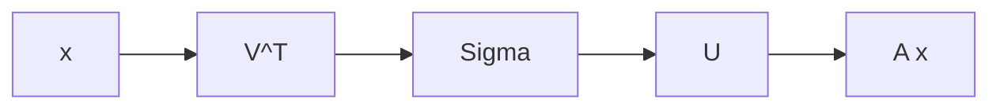

# Singular value decomposition

Every real matrix $A$ of size $m \times n$ factors as $A = U\Sigma V^\top$, where $U$
and $V$ have orthonormal columns and $\Sigma$ is diagonal with non-negative entries.

The diagonal entries $\sigma_1 \ge \sigma_2 \ge \dots \ge 0$ are the **singular
values**. Geometrically, $V^\top$ rotates the input, $\Sigma$ stretches along the axes,
and $U$ rotates the result out into the output space.

$$
A = U \Sigma V^\top = \sum_{i=1}^{r} \sigma_i u_i v_i^\top
$$

:::definition
**Rank-$k$ approximation.** Truncating the sum after $k$ terms gives the best rank-$k$
approximation of $A$ in the Frobenius and spectral norms alike (Eckart–Young).
:::

## Why it matters for ML

The SVD underpins PCA, latent semantic analysis, and low-rank compression of weight
matrices. Keeping the top $k$ singular values holds on to the most energy in the
matrix while discarding noise. [^src:lib-strang-la#p364]

:::deeper
The link to eigenvectors: the right singular vectors $v_i$ are eigenvectors of
$A^\top A$, and $\sigma_i^2$ are its eigenvalues. That is why PCA can be computed two
ways, and why numerical conditioning decides which one you actually use.
:::

[^src:lib-strang-la#p364]: Strang, *Introduction to Linear Algebra*, ch. 7.
